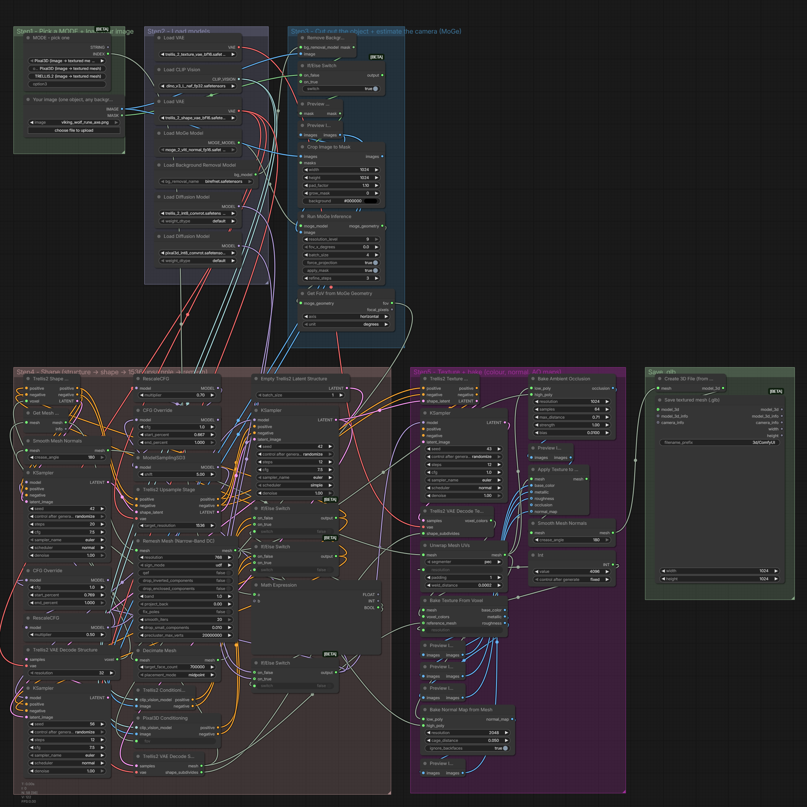

# The_frizzy1 — Image to 3D Ultimate · 12 GB v2.0.0
> One image in, textured .glb out - Pixal3D or TRELLIS.2 from a dropdown. Core ComfyUI nodes only.

| | |
|---|---|
| **Model family** | Pixal3D · TRELLIS.2 |
| **Tasks** | Image → textured 3D mesh |
| **Min VRAM** | 12 GB (tested) |
| **Tested on** | RTX 3060 12 GB · Ryzen 5 5600X · 32 GB DDR4 · ComfyUI 0.37.4 (Sage attention) |
| **YouTube explainer** | [ PASTE LINK ] |
| **License** | Workflow: MIT · Pixal3D / TRELLIS.2: MIT |

<p align="center"></p>

## Overview
The official Pixal3D + TRELLIS.2 template with a MODE dropdown: background removal, MoGe camera, shape, 1536 upsample, remesh, texture bake.

## Modes (one dropdown)

| Mode | Uses |
|---|---|
| Pixal3D | one image |
| TRELLIS.2 | one image |

## Measured on the RTX 3060

Each mode was run once through this exact workflow (5 s clips unless noted). *Wall* = queue to finished, including model loading; *sampling* = time in the sampler nodes.

| Mode | Size | Wall | Sampling | Peak VRAM | Peak RAM |
|---|---|---|---|---|---|
| Pixal3D |  | 3 min 51 s | 1 min 10 s | 10.5 GB | 8.2 GB |
| TRELLIS.2 |  | 5 min 33 s | 2 min 23 s | 10.6 GB | 8.3 GB |

## Required models
See [downloads.md](downloads.md) — every file was read from the workflow `.json`.

## Required custom nodes
None - core ComfyUI **0.37.4+**.

## Get the models (one command)

```bash
python scripts/frizzy.py doctor 3d/image-to-3d-ultimate-12gb --comfy "C:/path/to/ComfyUI"
```

## Installation
1. Update ComfyUI to **0.37.4+**.
2. Download the files in [downloads.md](downloads.md).
3. Load `The_frizzy1_image-to-3d-ultimate-12gb_v2.0.0.json`, pick a **MODE**, add your inputs, **Run**.

If your models live in sub-folders (e.g. `diffusion_models/LTX-2.5/`), the loaders show red until you re-pick them once.
