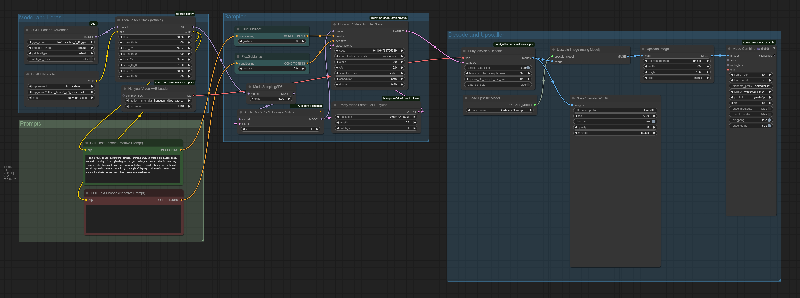

# The_frizzy1 — Hunyuan Video Low-VRAM v1.1.1

> Semi-native Hunyuan Video (I2V + T2V) on **4 GB VRAM**. GGUF + upscaler + RifleX. Works, but slow — Wan 2.1 is often better on tiny GPUs.

| | |
|---|---|
| **Model family** | Hunyuan Video |
| **Tasks** | Text → Video · Image → Video |
| **Min VRAM** | 4 GB |
| **Tested on** | RTX 3050 Laptop 4 GB (slow) |
| **CivitAI** | https://civitai.com/models/1312419 |
| **Hugging Face** | https://huggingface.co/The-frizzy1/Hunyuan-Video-Low-VRAM-4GB |
| **License** | Tencent Hunyuan Community |


## Preview

<details><summary>Workflow graph</summary>

<p align="center"></p>
</details>

## ⚠️ v1.1.1 fix
The originally shipped workflow had its diffusion loader pointing at `flux1-dev-Q5_K_S.gguf` (a leftover from
another graph). **v1.1.1 corrects it** to `fast-hunyuan-video-t2v-720p-Q5_K_M.gguf`. The untouched original is
kept in [`source/hunyuan.json`](source/). See [docs/AUDIT.md](../../../docs/AUDIT.md).

## Notes
- I2V encodes the image into latent space for *style* — it does not animate the image directly.
- T2V works well on low VRAM — check quantisation versions.
- Low on VRAM? Replace the sampler with **Tiled KSampler**.
- GGUF errors are usually fixed by updating nodes.
- **Tip from the creator:** Wan 2.1 performs better on low VRAM → [wan2.1/gguf-lowvram](../../wan2.1/gguf-lowvram).

## Get the models (one command)

From the repo root, this finds ComfyUI, downloads the missing models into the right folders, and installs the custom nodes:

```bash
python scripts/frizzy.py doctor hunyuan/video --comfy "C:/path/to/ComfyUI"
```

No pip installs. Details: [scripts/README.md](../../../scripts/README.md).

## Required models
Full verified table + links: **[downloads.md](downloads.md)**.

## Files
- `The_frizzy1_hunyuan-video-lowvram_v1.1.1.json` — corrected workflow.
- `source/hunyuan.json` — original (unfixed) as shipped.
- `images/workflow-image.png` — workflow graph screenshot.

## Changelog
See [changelog.md](changelog.md).

## Related workflows
- [Wan 2.1 GGUF Low-VRAM](../../wan2.1/gguf-lowvram) · [LTX-2 GGUF](../../ltx/ltx2)
