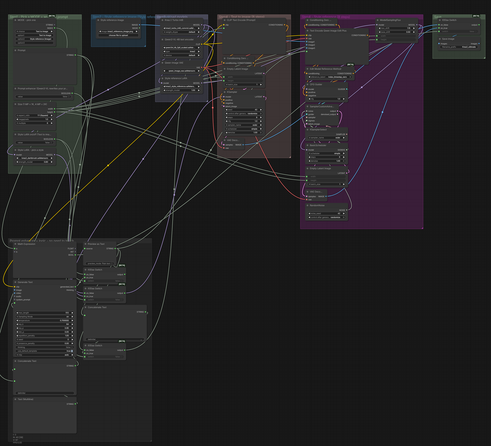

# The_frizzy1 — Krea 2 Ultimate · 12 GB v2.0.0
> Krea 2 Turbo text-to-image and image style reference in one workflow, with the official style LoRAs. Core nodes only.

| | |
|---|---|
| **Model family** | Krea 2 (Turbo) |
| **Tasks** | Text → Image · Style reference |
| **Min VRAM** | 12 GB (tested) |
| **Tested on** | RTX 3060 12 GB · Ryzen 5 5600X · 32 GB DDR4 · ComfyUI 0.37.4 (Sage attention) |
| **YouTube explainer** | [ PASTE LINK ] |
| **License** | Workflow: MIT · Krea 2: see the model page |

## Preview

<p align="center">
<a href="samples/sample-1.webp"></a>
<a href="samples/sample-2.webp"></a>
</p>

<sub>Click a frame to open the clip (Text to image, Style reference (image)).</sub>

<p align="center"></p>

## Overview
Both official Krea 2 Turbo templates in one graph: one MODE dropdown, a style-LoRA picker and the optional prompt enhancer.

## Modes (one dropdown)

| Mode | Uses |
|---|---|
| Text to image | prompt |
| Style reference (image) | prompt + style image |

## Measured on the RTX 3060

Each mode was run once through this exact workflow (5 s clips unless noted). *Wall* = queue to finished, including model loading; *sampling* = time in the sampler nodes.

| Mode | Size | Wall | Sampling | Peak VRAM | Peak RAM |
|---|---|---|---|---|---|
| Text to image | 1.0 MP | 26 s | 21 s | 11.4 GB | 4.5 GB |
| Style reference (image) | 1.0 MP | 50 s | 45 s | 11.1 GB | 7.1 GB |

## Required models
See [downloads.md](downloads.md) — every file was read from the workflow `.json`.

## Required custom nodes
None - core ComfyUI **0.37.4+**.

## Get the models (one command)

```bash
python scripts/frizzy.py doctor krea/krea-2-ultimate-12gb --comfy "C:/path/to/ComfyUI"
```

## Installation
1. Update ComfyUI to **0.37.4+**.
2. Download the files in [downloads.md](downloads.md).
3. Load `The_frizzy1_krea-2-ultimate-12gb_v2.0.0.json`, pick a **MODE**, add your inputs, **Run**.

If your models live in sub-folders (e.g. `diffusion_models/LTX-2.5/`), the loaders show red until you re-pick them once.
