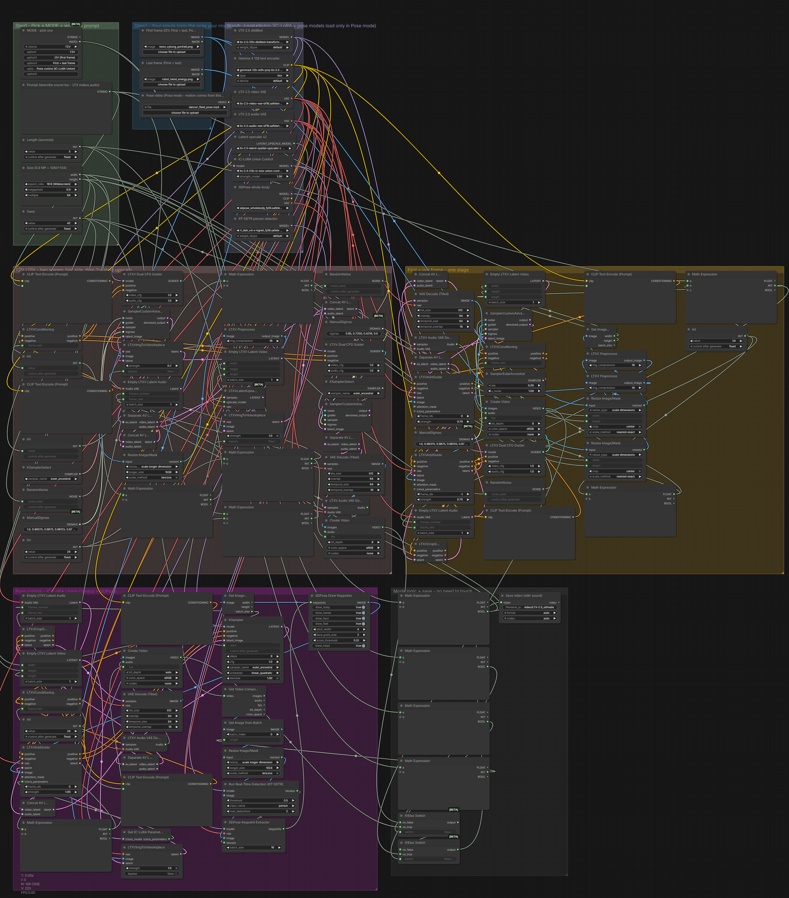

# The_frizzy1 — LTX 2.5 Ultimate · 12 GB v1.0.0

> LTX 2.5 text, image, first+last and pose-driven video in one workflow. Video with sound. Core ComfyUI nodes only, tested on an RTX 3060.

| | |
|---|---|
| **Model family** | LTX 2.5 (distilled) |
| **Tasks** | T2V · I2V · First+last frame · Pose control (IC-LoRA Union) |
| **Min VRAM** | 12 GB (tested) |
| **Tested on** | RTX 3060 12 GB · Ryzen 5 5600X · 32 GB DDR4 · ComfyUI 0.37.4 (Sage attention) |
| **YouTube explainer** | [ PASTE LINK ] |
| **License** | Workflow: MIT · LTX 2.5: LTX-2.x Community License |

## Preview

<p align="center">
<a href="samples/preview-1.mp4"></a>
<a href="samples/preview-2.mp4"></a>
</p>

<sub>Click a frame to open the clip (T2V, I2V (first frame)).</sub>

<p align="center"></p>

## Overview
Built from the official LTX 2.5 T2V / I2V / FLF2V templates and the LTX 2.3 IC-LoRA template (IC-LoRA Union Control runs on 2.5). One MODE dropdown; each path only runs when picked.

## Modes (one dropdown)

| Mode | Uses |
|---|---|
| T2V | prompt |
| I2V (first frame) | First frame |
| First + last frame | First + Last frame |
| Pose control (IC-LoRA Union) | First frame (character) + pose video |

## Measured on the RTX 3060

Each mode was run once through this exact workflow (5 s clips unless noted). *Wall* = queue to finished, including model loading; *sampling* = time in the sampler nodes.

| Mode | Size | Wall | Sampling | Peak VRAM | Peak RAM |
|---|---|---|---|---|---|
| T2V | 0.9 MP | 3 min 16 s | 1 min 42 s | 11.6 GB | 17.9 GB |
| I2V (first frame) | 0.9 MP | 2 min 58 s | 1 min 47 s | 11.6 GB | 18.0 GB |
| First + last frame | 0.9 MP | 5 min 01 s | 3 min 44 s | 11.5 GB | 18.9 GB |
| Pose control (IC-LoRA Union) | 0.9 MP | 7 min 56 s | 4 min 05 s | 11.6 GB | 22.3 GB |

## Required models
See [downloads.md](downloads.md) — every file was read from the workflow `.json`.

## Required custom nodes
None - core ComfyUI **0.37.4+**.

## Get the models (one command)

```bash
python scripts/frizzy.py doctor ltx/ltx-2.5-ultimate-12gb --comfy "C:/path/to/ComfyUI"
```

## Installation
1. Update ComfyUI to **0.37.4+**.
2. Download the files in [downloads.md](downloads.md).
3. Load `The_frizzy1_ltx-2.5-ultimate-12gb_v1.0.0.json`, pick a **MODE**, add your inputs, **Run**.

If your models live in sub-folders (e.g. `diffusion_models/LTX-2.5/`), the loaders show red until you re-pick them once.
