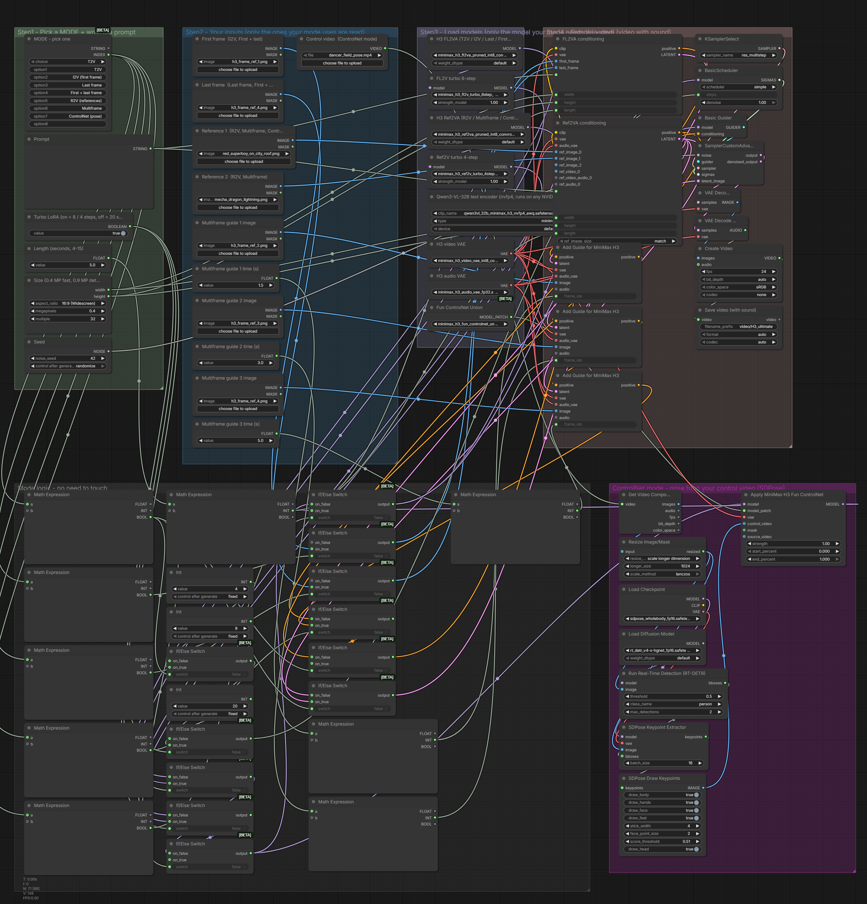

# The_frizzy1 — MiniMax H3 Ultimate · 12 GB v2.1.0
> Every local MiniMax H3 mode in one workflow - pick it from a dropdown. Video with sound. Core ComfyUI nodes only, tested on an RTX 3060.

| | |
|---|---|
| **Model family** | MiniMax H3 |
| **Tasks** | T2V · I2V · Last frame · First+last · R2V · Multiframe · ControlNet pose · Extend a clip (all with audio) |
| **Min VRAM** | 12 GB (tested) |
| **Tested on** | RTX 3060 12 GB · Ryzen 5 5600X · 32 GB DDR4 · ComfyUI 0.37.4 (Sage attention) |
| **YouTube explainer** | [ PASTE LINK ] |
| **License** | Workflow: MIT · MiniMax H3: MiniMax H3 Community License |

## Preview

<p align="center">
<a href="samples/preview-1.mp4"></a>
<a href="samples/preview-2.mp4"></a>
</p>

<sub>Click a frame to open the clip (T2V, I2V (first frame)).</sub>

<p align="center"></p>

## Overview
Built from the six official MiniMax H3 templates in ComfyUI 0.37.4. One MODE dropdown picks the model (FL2VA or Ref2VA), which inputs are read, the ControlNet and the multiframe guides. Switch nodes are lazy, so only the model your mode needs is loaded. Turbo LoRAs on by default (8 steps FL2V, 4 steps Ref2V).

## Modes (one dropdown)

| Mode | Uses |
|---|---|
| T2V | prompt |
| I2V (first frame) | First frame |
| Last frame | Last frame |
| First + last frame | First + Last frame |
| R2V (references) | Reference 1 + 2 |
| Multiframe | References + 3 timed guide frames |
| ControlNet (pose) | Reference 1 + video |
| Extend (continue a clip) | Video: its last 22 frames (~0.9 s) start the new clip and H3 continues it. The result begins with those frames, so trim ~0.9 s when you join the clips. Load a result back in to keep extending. *New in v2.1.0, not benchmarked yet.* |

## Character swap (the 9th H3 mode) → its own workflow

MiniMax H3 can do nine things; eight are in this workflow. The ninth, a full character swap, runs on Viggle's H3 finetune and needs the [comfyui-viggle-animate-h3](https://registry.comfy.org/nodes/comfyui-viggle-animate-h3) node pack plus ~22 GB of extra models. I decided to keep it separate so this workflow stays core ComfyUI nodes only: **[Viggle-Animate (H3) · 12 GB](../viggle-animate-h3)** (tested on the same RTX 3060).

## Measured on the RTX 3060

Each mode was run once through this exact workflow (5 s clips unless noted). *Wall* = queue to finished, including model loading; *sampling* = time in the sampler nodes.

| Mode | Size | Wall | Sampling | Peak VRAM | Peak RAM |
|---|---|---|---|---|---|
| T2V | 0.4 MP | 3 min 02 s | 2 min 28 s | 11.3 GB | 16.9 GB |
| I2V (first frame) | 0.4 MP | 3 min 20 s | 2 min 46 s | 11.3 GB | 17.1 GB |
| Last frame | 0.4 MP | 3 min 19 s | 2 min 46 s | 11.4 GB | 17.1 GB |
| First + last frame | 0.4 MP | 3 min 29 s | 2 min 54 s | 11.3 GB | 16.9 GB |
| R2V (references) | 0.4 MP | 2 min 10 s | 1 min 33 s | 11.4 GB | 16.9 GB |
| Multiframe | 0.4 MP | 2 min 18 s | 1 min 42 s | 11.3 GB | 16.9 GB |
| ControlNet (pose) | 0.4 MP | 4 min 59 s | 2 min 43 s | 11.3 GB | 20.1 GB |

## Required models
See [downloads.md](downloads.md) — every file was read from the workflow `.json`.

## Required custom nodes
None - core ComfyUI **0.37.4+** (native MiniMax H3, SDPose, Switch / Custom Combo / Math Expression).

## Get the models (one command)

```bash
python scripts/frizzy.py doctor minimax/h3-ultimate-12gb --comfy "C:/path/to/ComfyUI"
```

## Installation
1. Update ComfyUI to **0.37.4+**.
2. Download the files in [downloads.md](downloads.md).
3. Load `The_frizzy1_minimax-h3-ultimate-12gb_v2.1.0.json`, pick a **MODE**, add your inputs, **Run**.

If your models live in sub-folders (e.g. `diffusion_models/LTX-2.5/`), the loaders show red until you re-pick them once.
