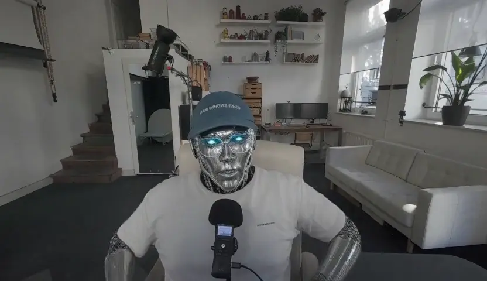
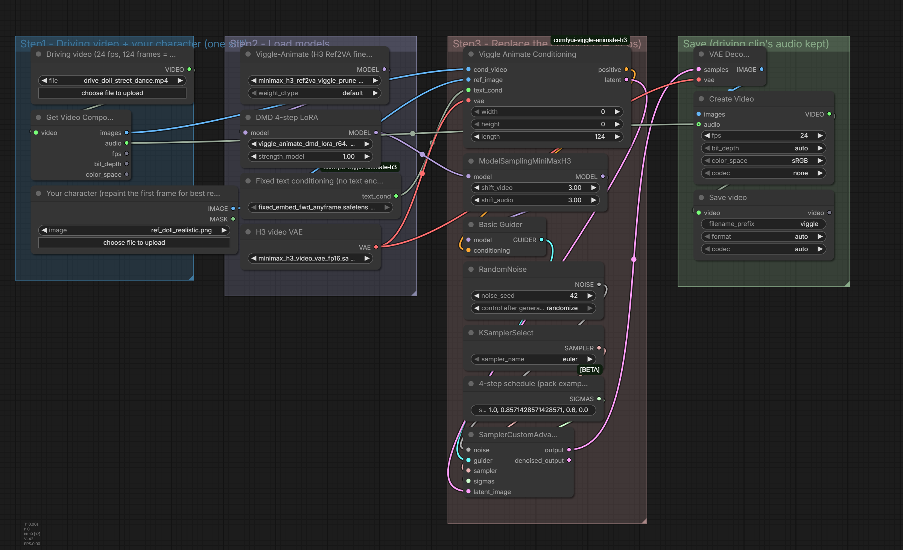

# The_frizzy1 — Viggle-Animate (MiniMax H3) · 12 GB v2.0.0
> Swap the person in any video for your character from one still - motion, camera, background and audio stay. 4 steps.

| | |
|---|---|
| **Model family** | Viggle-Animate (MiniMax H3 Ref2VA finetune) |
| **Tasks** | Character replacement in video |
| **Min VRAM** | 12 GB (tested) |
| **Tested on** | RTX 3060 12 GB · Ryzen 5 5600X · 32 GB DDR4 · ComfyUI 0.37.4 (Sage attention) |
| **YouTube explainer** | [ PASTE LINK ] |
| **License** | Workflow: MIT · Viggle-Animate: MiniMax H3 Community License |

## Preview

<p align="center">
<a href="samples/preview-1.mp4"></a>
<a href="samples/preview-2.mp4"></a>
</p>

<sub>Click a frame to open the clip (Doll street-dance clip (480x864), Talking clip, landscape (832x480)).</sub>

<p align="center"></p>

## Overview
Viggle's 33B finetune of H3 Ref2VA, run with its node pack's conditioning + loader nodes and core ComfyUI for the rest (native video load/save instead of VHS, ManualSigmas instead of custom sigma nodes). The driving clip's audio is kept.

## Modes (one dropdown)

| Mode | Uses |
|---|---|
| Character replacement | driving video + one character still |

## Measured on the RTX 3060

Each mode was run once through this exact workflow (5 s clips unless noted). *Wall* = queue to finished, including model loading; *sampling* = time in the sampler nodes.

| Mode | Size | Wall | Sampling | Peak VRAM | Peak RAM |
|---|---|---|---|---|---|
| Doll street-dance clip (480x864) | 480x864 | 4 min 33 s | 2 min 49 s | 11.3 GB | 15.8 GB |
| Talking clip, landscape (832x480) | 832x480 | 4 min 00 s | 2 min 36 s | 11.6 GB | 15.9 GB |
| Talking clip, portrait (480x832) | 480x832 | 3 min 53 s | 2 min 33 s | 11.2 GB | 14.7 GB |

## Required models
See [downloads.md](downloads.md) — every file was read from the workflow `.json`.

## Required custom nodes
[comfyui-viggle-animate-h3](https://registry.comfy.org/nodes/comfyui-viggle-animate-h3) (Comfy registry v1.3.2).

## Get the models (one command)

```bash
python scripts/frizzy.py doctor minimax/viggle-animate-h3 --comfy "C:/path/to/ComfyUI"
```

## Installation
1. Update ComfyUI to **0.37.4+**.
2. Download the files in [downloads.md](downloads.md).
3. Load `The_frizzy1_viggle-animate-h3_v2.0.0.json`, pick a **MODE**, add your inputs, **Run**.

If your models live in sub-folders (e.g. `diffusion_models/LTX-2.5/`), the loaders show red until you re-pick them once.
