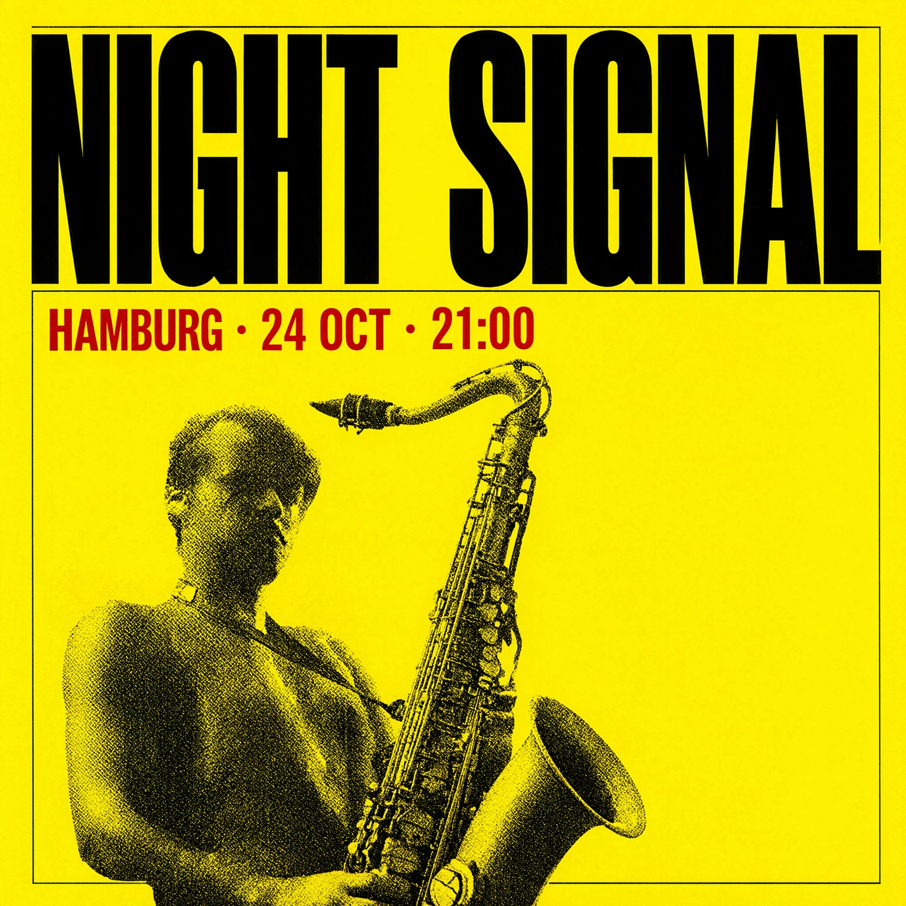
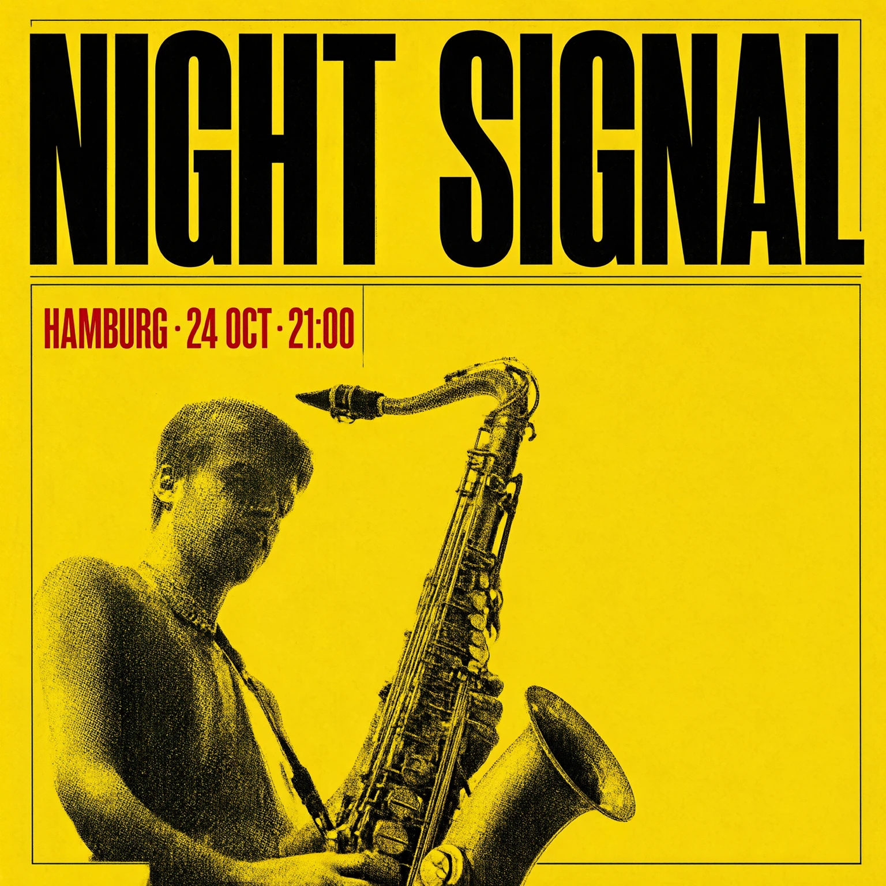
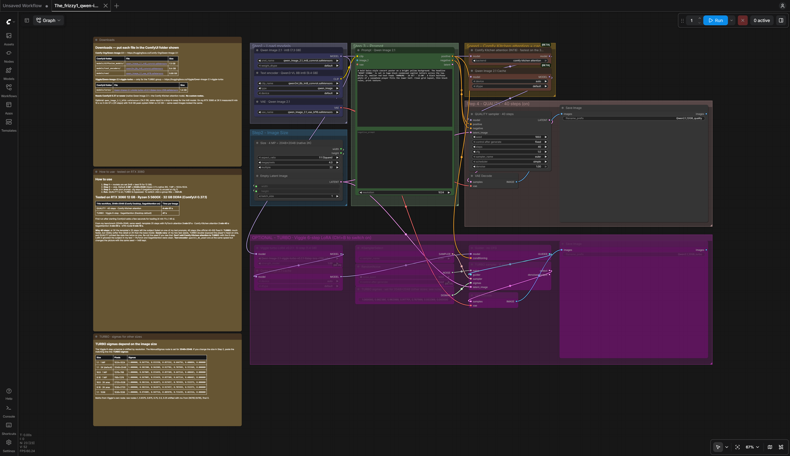

# The_frizzy1 — Qwen Image 2.1 · 12 GB v2.0.0
> Native **2K** Qwen Image 2.1 on a **12 GB** card — a QUALITY path (40 steps, Comfy Kitchen attention) and a
> one-click TURBO path (Viggle 6-step LoRA). Core ComfyUI nodes only, tested on an RTX 3060.

| | |
|---|---|
| **Model family** | Qwen Image 2.1 |
| **Tasks** | Text → Image (native 2K) |
| **Min VRAM** | 12 GB (tested) |
| **Tested on** | RTX 3060 12 GB · Ryzen 5 5600X · 32 GB DDR4 · ComfyUI 0.37.1 (Comfy Desktop) |
| **CivitAI** | Not published |
| **Hugging Face** | Not published |
| **YouTube explainer** | [ PASTE LINK ] |
| **License** | Workflow: MIT · Qwen Image 2.1 + Viggle LoRA: Qwen Research License (non-commercial) |

## Preview

<p align="center">
  
  
</p>

<sub>Left: QUALITY (40 steps, 4 min 07 s). Right: TURBO (Viggle 6-step, 47 s). Both 2048×2048 on the RTX 3060, same prompt.</sub>

<p align="center"></p>

## Overview
Built from the official *Qwen Image 2.1: Text to Image* template and tuned from my benchmark on a 12 GB RTX 3060:
int8 model + int8 text encoder, native 2048×2048, **40 steps** instead of the template's 25, and **Comfy Kitchen
INT8 attention** on the QUALITY path. A bypassed TURBO group adds Viggle's 6-step LoRA with Viggle's own sigma
schedule. No custom nodes.

## Capabilities
- Native 2K (4 MP) text-to-image — size is one widget (ResolutionSelector, 4 MP = 2048×2048)
- QUALITY path: 40 steps · euler/simple · cfg 1 · Comfy Kitchen attention
- TURBO path: Viggle turbo LoRA v0.2.1 · 6 steps · Viggle's shifted sigmas · no CFG
- Colour-coded groups: models (blue) · size · prompt (green) · speed (amber) · sampler · optional TURBO (purple)

## Hardware & VRAM
| | int8 (this workflow) | bf16 (optional swap) |
|---|---|---|
| Diffusion model file | 7.3 GB | 14.2 GB |
| Time per 2K image, 25 steps, PyTorch attention | 3 min 57 s | 6 min 10 s |
| Peak system RAM | 3.0 GB | 10.6 GB (offloads — doesn't fit in 12 GB) |

Same-seed int8 and bf16 images measured SSIM 0.89–0.99 over 4 prompts.

## Required models
See [downloads.md](downloads.md) — every file below was read from the workflow `.json`.

## Required custom nodes
None — core ComfyUI **0.37 or newer** (native Qwen Image 2.1, `ModelAttentionBackend`, `QwenImage21Cache`).

## Get the models (one command)

```bash
python scripts/frizzy.py doctor qwen/image-2.1-12gb --comfy "C:/path/to/ComfyUI"
```

## File placement
```
ComfyUI/models/
├── diffusion_models/   ← qwen_image_2.1_int8_convrot.safetensors
├── text_encoders/      ← qwen3vl_8b_int8_convrot.safetensors
├── vae/                ← qwen_image_2.1_vae_bf16.safetensors
└── loras/              ← Qwen-Image-2.1-viggle-turbo-v0.2.1-6step-lora-r256.safetensors   (TURBO only)
```

## Installation
1. Update ComfyUI to **0.37+**.
2. Download the files above (or run the one-command tool).
3. Load `The_frizzy1_qwen-image-2.1-12gb_v2.0.0.json`, write your prompt, **Run**.
4. For TURBO: click the QUALITY group title → **Ctrl+B** (bypass), then the TURBO group title → **Ctrl+B** (enable).

## Recommended settings
| Setting | Value | Notes |
|---|---|---|
| Size | 4 MP · 1:1 (2048×2048) | Qwen 2.1's native 2K |
| Steps (QUALITY) | 40 | the template's 25 left a subject faded at 2K in my test |
| cfg | 1 | negative prompt is unused at cfg 1 |
| Attention (QUALITY) | Comfy Kitchen | fastest in my benchmark |
| Attention (TURBO) | ComfyUI default (Sage on Comfy Desktop) | Comfy Kitchen + 6-step LoRA ghosted the subject in my test |
| TURBO sigmas | set for 2048×2048 | other sizes: copy the line from the in-workflow note |

## Inputs / Outputs
- **Inputs:** a text prompt
- **Outputs:** one PNG (2048×2048 by default)

## Performance
Measured with this exact workflow on the RTX 3060 (Comfy Desktop, SageAttention on), 2048×2048, warm run:

| Path | Time per image |
|---|---|
| QUALITY · 40 steps · Comfy Kitchen | **4 min 07 s** |
| TURBO · Viggle 6-step | **47 s** |

From the full benchmark (same machine, 2048×2048, 25 steps, same seed): PyTorch attention 3 min 57 s ·
SageAttention 3 min 00 s · Comfy Kitchen 2 min 40 s · Viggle 6-step 62 s (PyTorch) / 50 s (Sage) · Viggle 4-step 44 s.

## Known issues
- **TURBO is softer** in fine detail at 2K than the base model (measured and visible in 100% crops).
- **Seeds vary:** of two test seeds, TURBO double-exposed the subject's head on one, and QUALITY printed the date line twice on one → re-roll the seed.
- **Don't add Comfy Kitchen attention to TURBO** — it ghosted the subject with the 6-step LoRA in my test.
- **TURBO sigmas depend on the size** — change them with the size (table in the workflow note).
- The Viggle LoRA goes through ComfyUI's standard (merging) LoRA loader; Viggle's own unmerged-LoRA node was not used.
- **License:** Qwen Image 2.1 and the Viggle LoRA are under the Qwen Research License — non-commercial use.

## Changelog
See [changelog.md](changelog.md).

## Related workflows
- [Qwen Image & Edit 2509](../image-edit-2509) · [Z-Image Turbo](../../z-image/turbo)
