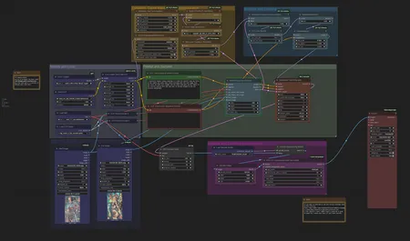

# The_frizzy1 — Wan 2.1 FLF2V v2.0.0

> Simple first-frame → last-frame video generation with Wan 2.1. Low-VRAM / laptop friendly (**4 GB**).

| | |
|---|---|
| **Model family** | Wan 2.1 (FLF2V 14B) |
| **Tasks** | First frame → Last frame video |
| **Min VRAM** | 4 GB |
| **CivitAI** | https://civitai.com/models/1624167 |
| **License** | Apache-2.0 |

## Preview

<p align="center"></p>

<sub>Example outputs from this workflow.</sub>

## Overview
Give a start image and an end image; Wan 2.1 FLF2V interpolates a video between them. This is the standalone
CivitAI release; the same graph also ships inside the [Wan 2.1 pack](../gguf-lowvram) as
`Wan2.1-FirstFrameLastFrame.json`.

## Get the models (one command)

From the repo root, this finds ComfyUI, downloads the missing models into the right folders, and installs the custom nodes:

```bash
python scripts/frizzy.py doctor wan2.1/flf2v --comfy "C:/path/to/ComfyUI"
```

No pip installs. Details: [scripts/README.md](../../../scripts/README.md).

## Required models
Full verified table + links: **[downloads.md](downloads.md)**.

## Changelog
See [changelog.md](changelog.md).

## Related workflows
- [Wan 2.1 GGUF Low-VRAM](../gguf-lowvram) · [Wan lineage note](../../../docs/WAN-LINEAGE.md)
