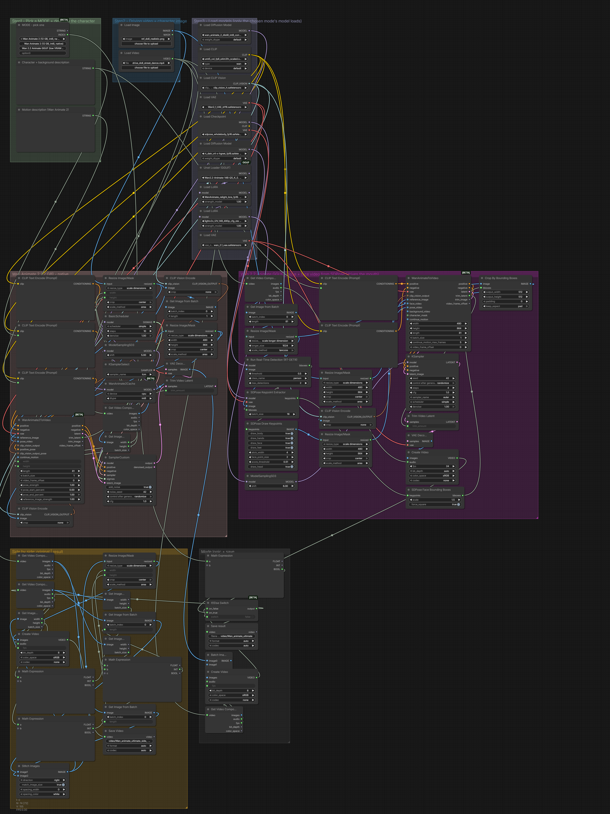

# The_frizzy1 — Wan Animate Ultimate v2.0.0
> Make any character move like your driving video - Wan Animate 2 (12 GB, native) or Wan 2.2 Animate GGUF (low VRAM). Original | result side-by-side included.

| | |
|---|---|
| **Model family** | Wan Animate 2 · Wan 2.2 Animate |
| **Tasks** | Character animation from a driving video |
| **Min VRAM** | 12 GB (tested) · GGUF path for less |
| **Tested on** | RTX 3060 12 GB · Ryzen 5 5600X · 32 GB DDR4 · ComfyUI 0.37.4 (Sage attention) |
| **YouTube explainer** | [ PASTE LINK ] |
| **License** | Workflow: MIT · Wan: Apache-2.0 |

## Preview

<p align="center">
<a href="samples/preview-1.mp4"></a>
<a href="samples/preview-2.mp4"></a>
</p>

<sub>Click a frame to open the clip (Wan Animate 2 (12 GB, 81 frames), Wan 2.2 Animate GGUF (Q5_K_S, 81 frames, face video)).</sub>

<p align="center"></p>

## Overview
Replaces the 5-custom-node v1.2.0 Animate workflow. Wan Animate 2 path is all core nodes; the GGUF path needs only ComfyUI-GGUF and uses SDPose for pose.

## Modes (one dropdown)

| Mode | Uses |
|---|---|
| Wan Animate 2 (12 GB) | driving video + character image |
| Wan 2.2 Animate GGUF | driving video + character image |

## Measured on the RTX 3060

Each mode was run once through this exact workflow (5 s clips unless noted). *Wall* = queue to finished, including model loading; *sampling* = time in the sampler nodes.

| Mode | Size | Wall | Sampling | Peak VRAM | Peak RAM |
|---|---|---|---|---|---|
| Wan Animate 2 (12 GB, 81 frames) | 480x864 | 10 min 31 s | 9 min 31 s | 11.4 GB | 17.5 GB |
| Wan 2.2 Animate GGUF (Q5_K_S, 81 frames, face video) | 480x864 | 7 min 05 s | 4 min 51 s | 11.7 GB | 24.6 GB |


> Measured with v1.0.0. In v1.0.0 the relight LoRA did not load (see [changelog](changelog.md)), so the GGUF row ran without relight; v2.0.0 loads it.

## Required models
See [downloads.md](downloads.md) — every file was read from the workflow `.json`.

## Required custom nodes
Wan Animate 2 mode: none. GGUF mode: [ComfyUI-GGUF](https://github.com/city96/ComfyUI-GGUF).

## Get the models (one command)

```bash
python scripts/frizzy.py doctor wan2.2/animate-ultimate --comfy "C:/path/to/ComfyUI"
```

## Installation
1. Update ComfyUI to **0.37.4+**.
2. Download the files in [downloads.md](downloads.md).
3. Load `The_frizzy1_wan-animate-ultimate_v2.0.0.json`, pick a **MODE**, add your inputs, **Run**.

If your models live in sub-folders (e.g. `diffusion_models/LTX-2.5/`), the loaders show red until you re-pick them once.
